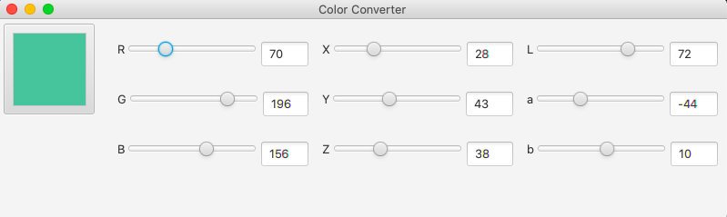

# Color Converter
In this repo you can find sources for a simple JavaFX app that converts colors between RGB, XYZ, and Lab.

## Usage
Below you can see how the app looks:

Using the button on the left, you can choose a color from a color palette.
You can also move sliders or input exact colors using text fields. 

If a color you've picked is not representable in some of the color formats, you will see a warning below. The color components that don't fit into boundaries will be trimmed to fit. For example, if you get an RGB color (-10, 230, 200) it will become (0, 230, 200).

## Structure
- [ConverterApp](src/ui/ConverterApp.java) is the main class of this app. It creates the user interface and handles user input.
  - [controlStyle.css](src/ui/controlStyle.css) stores custom styles for JavaFX controls.
- [Converter](src/conversion/Converter.java) is the class that handles conversion between formats.
- [RGB](src/conversion/RGB.java), [XYZ](src/conversion/XYZ.java), and [Lab](src/conversion/Lab.java) are classes for storing colors.
- [OutOfBoundsException](src/exception/OutOfBoundsException.java) is an exception that occurs when a color is not representable in some format.
